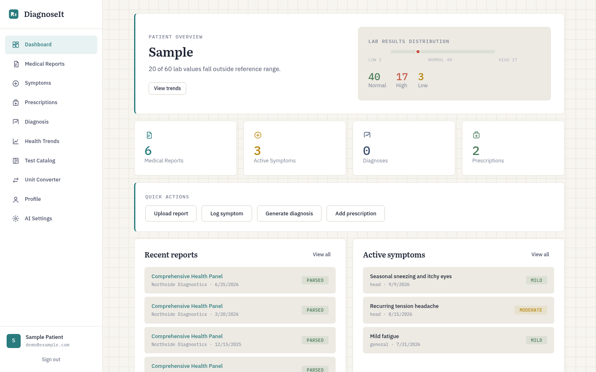
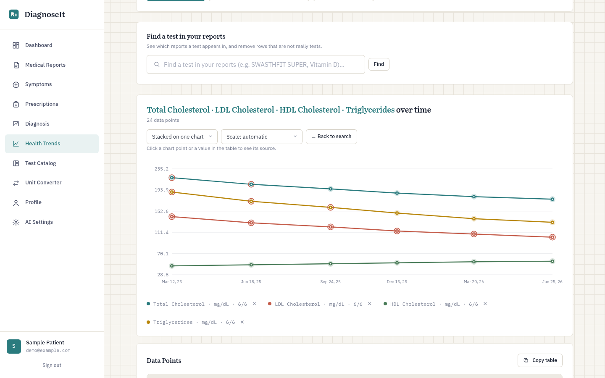
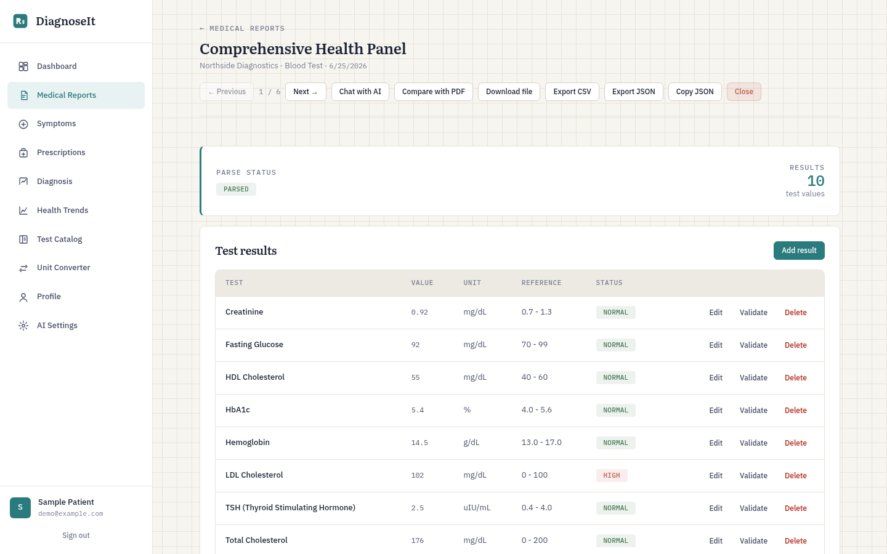
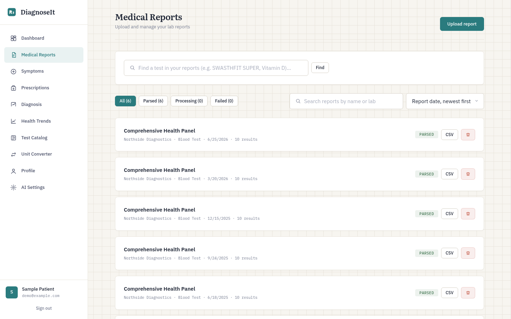
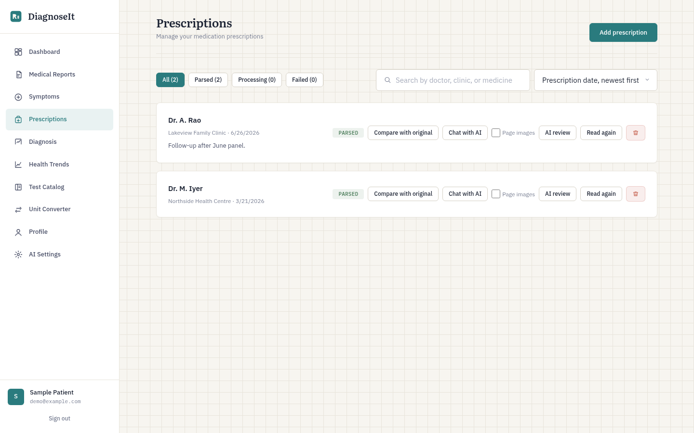
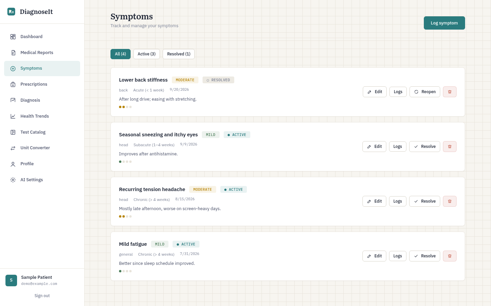
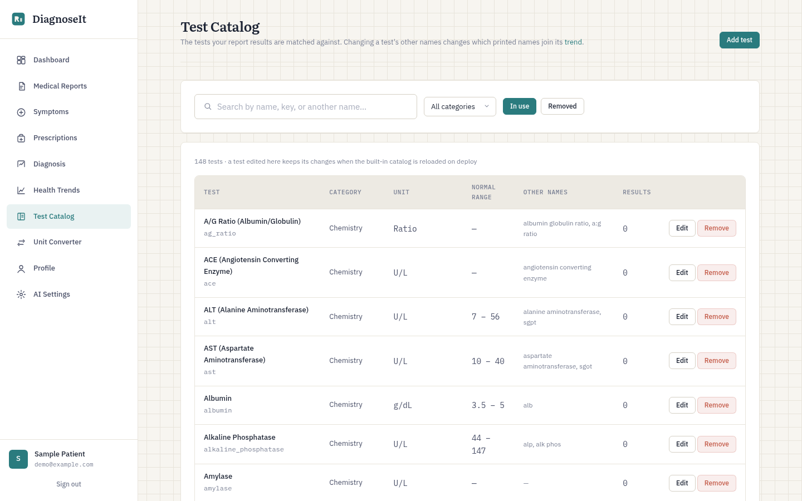

# DiagnoseIt

Self-hosted health records for lab reports, prescriptions, symptoms, and health trends.

## About

DiagnoseIt keeps your medical documents in one place you control. Upload a lab report or prescription and it extracts the results, links them to a shared lab test catalog, and charts them over time. Optional AI services can read scans, review what was extracted, answer questions about a document, and suggest a differential diagnosis.

> DiagnoseIt is not medical advice. Check extracted results and AI answers with a qualified clinician.

## Features

- **Lab reports**: PDF and scan upload (single or bulk), text and vision-model parsing, background processing with live status, side-by-side PDF comparison, JSON export
- **Health trends**: one entry per catalog test, values converted into a common unit, up to six tests charted together on a shared date axis
- **Lab test catalog**: ranges, units, aliases and unit conversions; editable in the app, with printed names matched to the right test
- **Prescriptions**: clinic PDFs or photos read into editable medicine lists, with AI review of the result
- **Symptoms**: log symptoms with updates and end dates
- **AI (optional)**: report OCR, report review with undoable suggestions, per-document chat, and differential diagnosis or health-timeline analysis; works with Ollama or any OpenAI-compatible API
- **Privacy**: records are private to each account; names, phone numbers and emails are redacted before text reaches a model
- **Web and mobile**: React web app and an Expo mobile app

## Tech Stack

| Layer | Technology |
|-------|------------|
| Backend | Python 3.13, Django 5, Django REST Framework |
| Background jobs | Celery, Redis |
| Database | PostgreSQL |
| Web | React 19, TypeScript, Vite, served by Nginx |
| Mobile | React Native, Expo |
| PDF and OCR | pdfplumber, vision models via Ollama or an OpenAI-compatible API |
| Deployment | Docker Compose |

## Getting Started

Requires Docker Compose v2.24 or newer.

```bash
git clone https://github.com/rms523/diagnoseit.git
cd diagnoseit
docker compose up -d --build
```

Open [http://localhost:3000](http://localhost:3000) and create the first account, which becomes the administrator. Do this before exposing the server to a network: until then, whoever registers first gets that role (or set `DJANGO_SUPERUSER_USERNAME` and `DJANGO_SUPERUSER_PASSWORD` in `.env` to create it on first start). The first start runs migrations and loads the lab test catalog. Data stays in Docker volumes across rebuilds.

To reach it from other devices or the internet, copy `.env.example` to `.env` and set `DIAGNOSEIT_BIND`, `ALLOWED_HOSTS`, and the HTTPS options (use a TLS reverse proxy that passes `X-Forwarded-Proto`). The file also lists database, sign-up, and AI settings.

To update, run `git pull` and `docker compose up -d --build`. Back up the database and media first, and never run `docker compose down -v` unless you mean to delete your data.

For scanned PDFs and photos, start the optional local OCR server with `docker compose --profile ollama up -d` and `docker compose exec ollama ollama pull qwen3-vl:4b`, then choose models under **Settings → AI**. CPU OCR can take minutes per page.

More: [AGENTS.md](AGENTS.md) (architecture and behaviour), [report formats guide](report_formats/README.md).

## Screenshots

Synthetic demo data.

| | |
|---|---|
| <br>Dashboard | <br>Health trends, several tests on one chart |
| <br>Extracted results with reference ranges and status | <br>Report list with search, sort and status filter |
| <br>Prescriptions | <br>Symptom tracking |
| <br>Editable lab test catalog | |

## License

[MIT](LICENSE).
